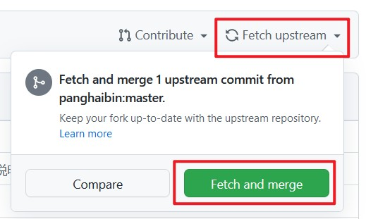

> The program now supports automatic generation of **realistic** XingCheng codes and SuiShen codes.
> 
> The location information of the XingCheng code comes from the address in the SHU SelfReport system, and the green QR code in the SuiShen code is generated randomly each time.

项目地址：<https://github.com/panghaibin/shuasr>

## 特色
- 支持在 GitHub Actions 或自建服务器上使用

- 多用户功能，可为多人填报

- 支持[多种消息推送接口](#填报结果消息推送介绍)，可将上报结果仅发送给一人

- 实现了自动补报功能，填报时自动检测是否需要补报

- 自动获取最新一次填报信息进行上报，如需修改地址等信息，当天手动重新填报一次，程序下次填报将自动采用

- 填报时可自动生成 XingCheng 码和 SuiShen 码

- 自动阅读所有消息，可通过消息推送接口推送必读消息

- 支持 ~~卷王~~ 抢排名模式（需使用自建服务器，不支持在 GitHub Actions 上使用）：

    

## 使用

### 方法一  使用 GitHub Actions 填报
#### i. 开始
点击本项目右上角的`Star`和`Fork`


#### ii. 添加 USERS Secret
Fork 项目后，在自己 Fork 后的项目的页面依次点击 `Settings`-`Secrets`-`Actions`-`New repository secret`


如图所示， `Name` 处输入 `USERS` ， `Value` 处输入学号和密码，格式为 `学号1,密码1;学号2,密码2...` ，即学号与密码用`英文逗号`分隔开，多个用户之间用`英文分号`分隔开，最后结尾不用加分号，只有一个用户也不用加


输入完毕后，点击`Add secret`添加

#### iii. 添加 SEND Secret （可选）

需要在第三方消息推送接口申请 key 后，采用同样的方法配置该 Secret。配置后可在每次 GitHub Actions 执行填报后，将填报结果发送给自己。

Secret 的 `Name` 设置为 `SEND` ， `Value` 格式为 `send_api,send_key` ， `send_api` 代表消息推送接口代号， `send_key` 代表消息推送接口密钥。例如： `2,5e58d2264821c69ebcd46c448e7f5fe6` ， `3,123456789:mbpSwrgRCr1iLt4MZRYqq0mlko-MGXMcg@987456321` 等。

对于支持的消息推送接口及其代号查询，可参考 [填报结果消息推送介绍](#填报结果消息推送介绍)。

#### iv. 开启 Actions
如下图所示


此时 Actions 开启成功，为确保能够填报成功，程序将会在 **北京时间 (UTC+8) 每天 6:30 及 12:30** 各执行一次，如需修改填报时间，可在 `.github/workflows/report.yml` 下修改

可以点击 `Run workflow` 测试填报一下，确认可以成功填报


#### v. 更新项目
可以选择安装 GitHub Apps 中的 [Pull App](https://github.com/apps/pull) ，保持你的 Fork 始终最新。
[](https://github.com/apps/pull)

安装时默认会应用到所有项目，建议改为手动按需选择需要应用的项目。注意该 App 会强制覆盖你对 Fork 项目的操作，如果你有改动（例如修改了 `.github/workflows/report.yml` ），请注意备份

若不安装，当本项目更新后，你 Fork 的项目并不会自动更新，需要手动 `Fetch and merge` 一下，如下图所示，在你 Fork 后的项目页执行该操作



你可以 `Watch` 本项目以确保项目更新时能收到消息

### 方法二  在自己的服务器上填报
#### i. 下载/更新
```shell
git clone https://github.com/panghaibin/shuasr.git
cd shuasr
# 更新
git pull
```

#### ii.安装依赖
```shell
pip3 install -r requirements.txt
```

#### iii. 添加用户，设置消息推送API

##### 方法一：命令行下添加
```shell
# 添加用户
# 如需修改已添加用户的密码，再次执行并输入相同学号即可
python3 main.py add
# 设置消息推送API
python3 main.py send
```

推送API设置可参考 [填报结果消息推送介绍](#填报结果消息推送介绍)

##### 方法二：手动修改配置文件 
修改目录下`config.bak.yaml`文件名为`config.yaml`，按照文件所写格式修改填写。

#### iv. 启动
添加设置完毕用户及消息发送API后，建议先执行以下命令测试

```shell
python3 main.py test
```

该命令会将所有用户立即上报一次，如控制台无异常输出且能收到消息推送，说明设置无误。若出现异常报错有可能是健康之路已改版，等待更新或向我提PR。

运行以下命令，程序将自行检查是否在上报时间内，并自动进行上报
```shell
python3 main.py
```

#### v. 进程守护
启动程序后若关闭控制台程序会自动退出，因此需要进程守护。进程守护的方式有多种，如使用`nohup`命令：

```shell
nohup /usr/bin/python3 /root/shuasr/main.py > /root/shuasr/output.log 2>&1 &
```

另外也可以用`screen`，下面以`screen`为例介绍用法。

安装`screen`（部分系统已安装）

```shell
# CentOS
yum install screen
# Debian/Ubuntu
apt-get install screen
```

然后创建一个名为`shu`的screen会话

```shell
screen -L -S shu
```

默认情况下会生成一`screenlog.0`文件，控制台输出将会保存到该文件中，如有错误信息方便查看。

执行`python3 main.py`，按下`Ctrl`+`a`，然后按`d`，离开当前screen会话。

如需恢复，执行

```shell
screen -r shu
```

即可

## 填报结果消息推送介绍
目前支持以下消息推送服务：

| 接口代号 | 名称| 官网 |
| :---: | :---: | :---: |
| 1 | Server酱 | https://sct.ftqq.com/ |
| 2 | 推送加（hxtrip域名下） | https://pushplus.hxtrip.com/ |
| 3 | Telegram Bot | 需自行创建`Bot`，[查看创建方法](./Telegram_bot.md)|
| 4 | PushDeer（开发中，未完善） | https://github.com/easychen/pushdeer |

请前往任意官网注册得到`key`后即可在本项目中使用，在 GitHub Actions 中使用时注意接口代号正确设置。

注意 Telegram Bot 的 Key 的格式为 `BOT_TOKEN@CHAT_ID` ，例如 `123456789:mbpSwrgRCr1iLt4MZRYqq0mlko-MGXMcg@987456321`

## 抢排名模式介绍
该模式仅支持在自建服务器上使用。功能默认开启，每天凌晨 1 点前会向系统不断提交当日的日报信息直到提交成功，以提升排名。如需关闭，修改`config.yaml`中的`grab_mode`值为`False`即可。

关闭后每天7:30填报一次。

## 更新日志
[点击查看](./CHANGELOG.md)

## 说明

本项目在 2020 年初用 PHP 编写 ~~（为了抢排名第一）~~ ，返校后为了帮室友上报把源代码改得面目全非 ~~（传说中的屎山）（又不是不能用）~~ 。寒假离校后受下列开源项目启发，用 Python3 对 PHP 编写的源代码进行了重写重构。

本项目仅供学习交流之用，请勿用于其它用途。请遵守当地防疫守则。

**Take care of yourself, and be well!**

## Thanks
[BlueFisher/SHU-selfreport](https://github.com/BlueFisher/SHU-selfreport)
